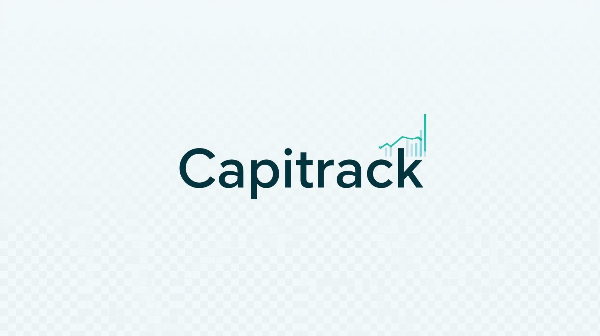
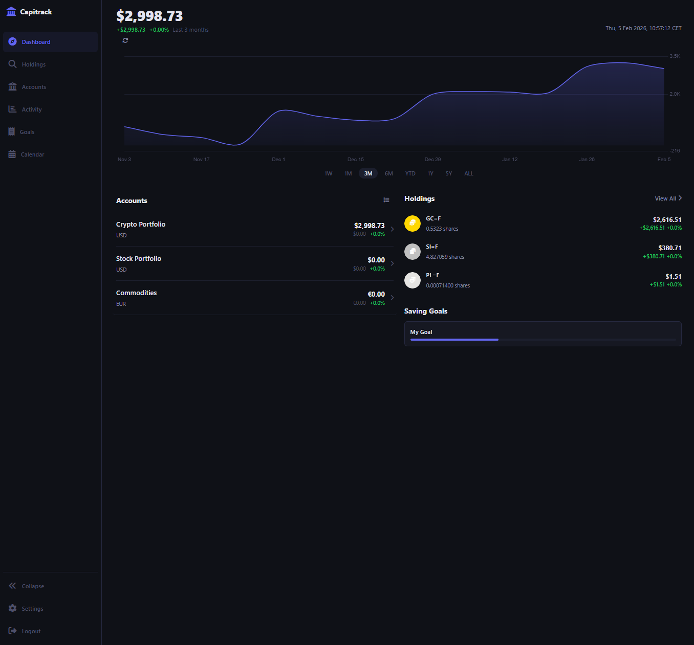
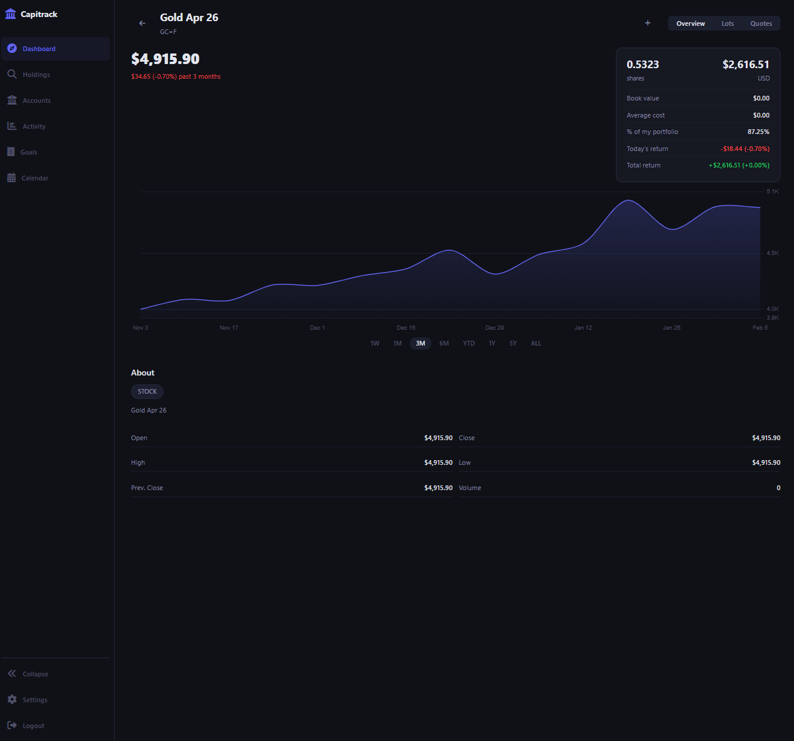
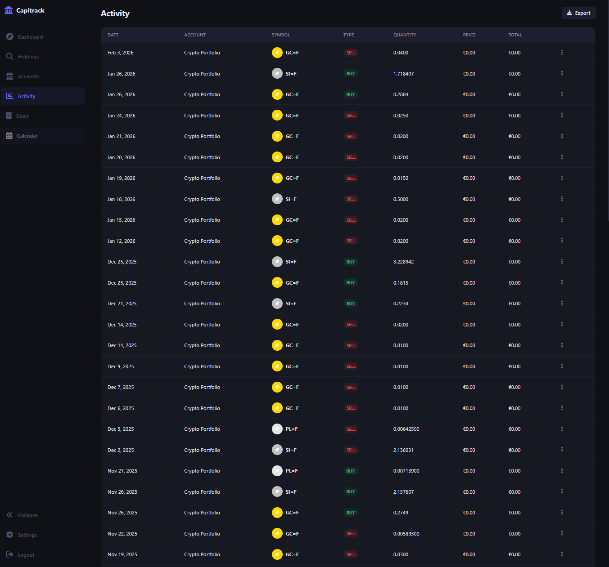
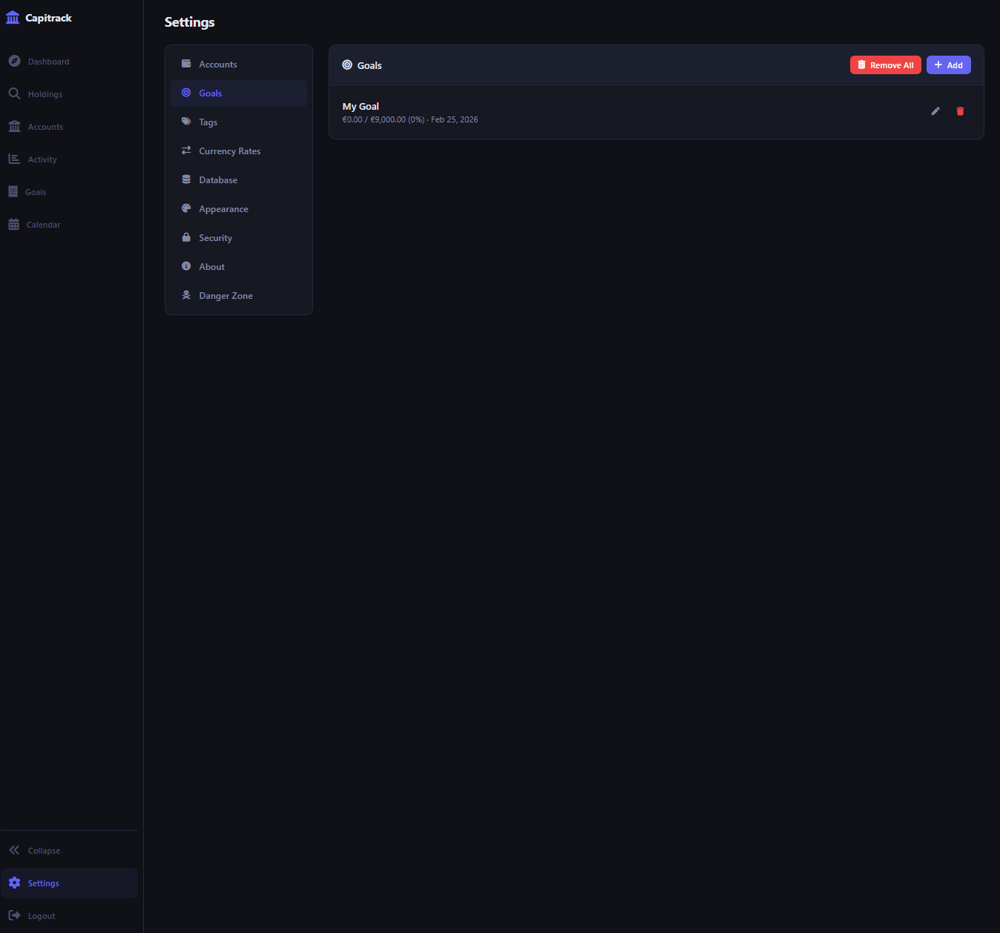

<p align="center">
  
</p>

<p align="center">
  <a href="https://github.com/jeff-nasseri/Capitrack/actions/workflows/ci.yml">
    
  </a>
  <a href="https://github.com/jeff-nasseri/Capitrack/blob/master/LICENSE">
    
  </a>
  <a href="https://www.npmjs.com/package/capitrack">
    
  </a>
</p>

# Capitrack

**Personal wealth tracking and investment portfolio management platform**

Capitrack is an open-source, self-hosted application for tracking your investments across multiple accounts including stocks, cryptocurrencies, and commodities. Get real-time price data, visualize your portfolio performance, and set financial goals.

## Features

- **Multi-Account Portfolio Tracking** - Track investments across stocks, crypto, and commodities
- **Real-Time Price Data** - Automatic price fetching from Yahoo Finance
- **CSV Import** - Import transactions from Revolut, Trezor, or generic CSV files
- **Portfolio Analytics** - Charts, performance metrics, and historical tracking
- **Financial Goals** - Set and track goals by year, quarter, month, or week
- **Currency Conversion** - Support for multiple currencies with conversion rates
- **Dark/Light Themes** - Beautiful UI that works in any lighting
- **Self-Hosted** - Your data stays on your server

<p align="center">
  
  
</p>

<p align="center">
  
  
</p>


## Quick Start

### Using npm

```bash
# Install globally
npm install -g capitrack

# Run
capitrack
```

### Using Docker

```bash
# Using Docker Compose
docker-compose up -d

# Or using Docker directly
docker run -d -p 3000:3000 -v capitrack-data:/app/data capitrack
```

### From Source

```bash
# Clone the repository
git clone https://github.com/jeff-nasseri/Capitrack.git
cd Capitrack

# Install dependencies
npm install

# Build TypeScript
npm run build

# Start the server
npm start
```

Visit `http://localhost:3000` and login with the default credentials:
- **Username:** admin
- **Password:** admin

> **Important:** Change the default password immediately after first login!

You can customize the initial credentials by setting environment variables before first run:
```bash
export CAPITRACK_INIT_USERNAME=myuser
export CAPITRACK_INIT_PASSWORD=mysecurepassword
```

See `.env.template` for all available configuration options.

## Configuration

### Environment Variables

| Variable | Description | Default |
|----------|-------------|---------|
| `PORT` | Server port | `3000` |
| `DB_PATH` | Path to SQLite database | `./data/capitrack.db` |
| `SESSION_SECRET` | Session encryption key | Random on each start |

### Docker Compose

```yaml
version: '3.8'
services:
  capitrack:
    image: capitrack
    ports:
      - "3000:3000"
    volumes:
      - capitrack-data:/app/data
    environment:
      - SESSION_SECRET=your-secret-key
    restart: unless-stopped

volumes:
  capitrack-data:
```

## Screenshots

### Dashboard
Track your total wealth, see performance charts, and monitor all accounts at a glance.

### Portfolio Analytics
Visualize your portfolio performance over time with interactive charts.

### Financial Goals
Set and track financial goals with hierarchical organization by year, quarter, month, and week.

## Development

### Prerequisites

- **Node.js 18.x** or higher
- **npm 9.x** or higher
- **Build tools** for native modules:
  - **Windows:** Visual Studio Build Tools with "Desktop development with C++" workload
  - **macOS:** Xcode Command Line Tools (`xcode-select --install`)
  - **Linux:** `build-essential` package

### Setup

```bash
# Install dependencies
npm install

# Run in development mode with hot reload
npm run dev

# Run tests
npm test

# Build for production
npm run build
```

> **Note:** The `better-sqlite3` package requires compilation of native bindings. If you encounter build errors, ensure you have the required build tools installed for your platform.

## API Documentation

Capitrack provides a RESTful API for all operations:

- `POST /api/auth/login` - Authenticate
- `GET /api/accounts` - List all accounts
- `GET /api/transactions` - List transactions
- `GET /api/prices/quote/:symbol` - Get price for symbol
- `GET /api/prices/dashboard/summary` - Get portfolio summary

See the [API documentation](docs/api.md) for full details.

## Tech Stack

- **Backend:** Node.js, Express, TypeScript
- **Database:** SQLite with better-sqlite3
- **Frontend:** Vanilla JavaScript, CSS3, Chart.js
- **Price Data:** Yahoo Finance API

## Contributing

We welcome contributions! Please see [CONTRIBUTING.md](CONTRIBUTING.md) for guidelines.

## Security

For security concerns, please see [SECURITY.md](SECURITY.md).

## License

This project is licensed under the MIT License - see the [LICENSE](LICENSE) file for details.

## Support

- **Issues:** [GitHub Issues](https://github.com/jeff-nasseri/Capitrack/issues)
- **Discussions:** [GitHub Discussions](https://github.com/jeff-nasseri/Capitrack/discussions)
