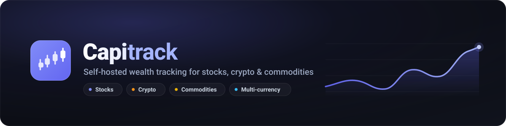

<p align="center">
  
</p>

<p align="center">
  <a href="https://github.com/jeff-nasseri/Capitrack/actions/workflows/build.yml"></a>
  <a href="https://github.com/jeff-nasseri/Capitrack/actions/workflows/backend-tests.yml"></a>
  <a href="https://github.com/jeff-nasseri/Capitrack/actions/workflows/frontend-tests.yml"></a>
  <a href="https://github.com/jeff-nasseri/Capitrack/actions/workflows/codeql.yml"></a>
  <a href="https://capitrack.dev"></a>
  <a href="LICENSE"></a>
</p>

# Capitrack

**Personal wealth tracking and investment portfolio management platform.**

Capitrack is an open-source, self-hosted app for tracking investments across multiple
accounts — stocks, crypto, and commodities — with real-time prices from Yahoo Finance,
portfolio analytics, CSV import, financial goals, and a wealth calendar.

Built with a **.NET 10 (ASP.NET Core) API** and a **Blazor WebAssembly** frontend.

🌐 **Website:** [capitrack.dev](https://capitrack.dev) &nbsp;·&nbsp; 📖 **Documentation:** [capitrack.dev/docs](https://capitrack.dev/docs/getting-started.html)

## Quick start

```bash
git clone https://github.com/jeff-nasseri/Capitrack.git
cd Capitrack
docker compose up -d
```

Open **http://localhost:3000** and sign in as **`admin`**. The database starts **empty**,
and on first run a **random admin password is generated and printed to the logs**:

```bash
docker compose logs api
```

To choose your own password instead, copy `.env.example` to `.env` and set
`CAPITRACK_INIT_PASSWORD` before the first run. Change it any time from **Settings → Security**.

## Features

- Multi-account portfolio tracking (stocks, crypto, commodities)
- Real-time prices from Yahoo Finance
- CSV import (Revolut, Trezor, or generic) with auto-detection and de-duplication
- Dashboard, holdings, and per-account / per-symbol analytics with interactive charts
- Financial goals and a wealth calendar
- Multi-currency support with conversion rates
- Dark / light themes — self-hosted, your data stays on your server

## Documentation

📖 Read the documentation online at **[capitrack.dev/docs](https://capitrack.dev/docs/getting-started.html)**
([Getting Started](https://capitrack.dev/docs/getting-started.html) ·
[Configuration](https://capitrack.dev/docs/configuration.html) ·
[CSV Import](https://capitrack.dev/docs/csv-import.html) ·
[API Reference](https://capitrack.dev/docs/api-reference.html)) — or browse the full source in [`docs/`](docs/):

| Doc | What it covers |
|-----|----------------|
| [Architecture](docs/architecture.md) | Technical design, components, data flow |
| [API Reference](docs/api.md) | Every REST endpoint |
| [Usage Guide](docs/usage.md) | Using the platform, page by page |
| [CSV Import](docs/csv-import.md) | Supported formats and field mapping |
| [Development](docs/development.md) | Build, test, and run locally |
| [Deployment](docs/deployment.md) | Docker, configuration, environment variables |
| [Migration Notes](docs/migration.md) | The Node → .NET / Blazor migration |

## License

[MIT](LICENSE) · Contributions welcome — see [docs/CONTRIBUTING.md](docs/CONTRIBUTING.md).
