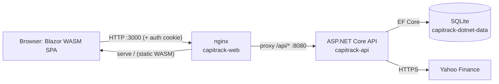

# Architecture

Capitrack is a self-hosted, single-user wealth tracker built as **two containers**
orchestrated by a single `docker compose` file:

- **`src/Capitrack.Api`** — an ASP.NET Core Web API (.NET 10, C#) using EF Core + SQLite.
- **`src/Capitrack.Web`** — a Blazor WebAssembly SPA, served by **nginx**, which also
  reverse-proxies `/api/*` to the API container.

The split exists so the browser talks only to nginx: nginx serves the static WASM app
and forwards API calls to the backend on the internal Docker network. Because the proxy
keeps everything same-origin, the authentication cookie set by the API is sent back on
every API request without any CORS handling.

## Container topology

```
                                  Docker network (compose)
                          ┌───────────────────────────────────────────┐
   Browser                │                                           │
 ┌─────────┐   :3000      │   ┌─────────────────────┐                 │
 │  WASM   │──────────────┼──▶│  capitrack-web      │                 │
 │  SPA +  │   HTTP       │   │  (nginx:alpine)     │                 │
 │ cookie  │◀─────────────┼───│  serves /           │                 │
 └─────────┘              │   │  proxies /api/  ────┼───┐  :8080       │
                          │   └─────────────────────┘   │  (expose,    │
                          │                              ▼   internal)  │
                          │                    ┌──────────────────────┐ │
                          │                    │  capitrack-api       │ │
                          │                    │  (ASP.NET Core /.NET) │ │
                          │                    │  EF Core + SQLite     │ │
                          │                    └───────────┬──────────┘ │
                          │                                │            │
                          │              named volume      │            │
                          │       capitrack-dotnet-data ───┘            │
                          │       (SQLite db + DataProtection keys)     │
                          └───────────────────────────────────────────┘
                                          │
                                          ▼  outbound HTTPS
                                  Yahoo Finance (prices / history / search)
```



- The **web** container publishes host port **3000** (`3000:80`) by default and serves the
  compiled Blazor WASM bundle plus the SPA fallback. The API container is **internal only**
  (`expose: "8080"`, no host port).
- The web container `depends_on` the api container's healthcheck (`condition: service_healthy`).

## Request flow (browser → nginx → API)

1. The browser loads `index.html` and the Blazor WASM framework files from nginx.
2. The SPA issues `fetch` calls to relative paths like `/api/prices/dashboard/summary`.
3. nginx matches `location /api/` and proxies to `http://api:8080`, forwarding
   `Host`, `X-Real-IP`, `X-Forwarded-For`, `X-Forwarded-Proto`, and `X-Forwarded-Host`
   (see `docker/nginx.conf`).
4. The API authenticates the request via the auth cookie, runs the controller action,
   and returns JSON (snake_case).
5. Non-`/api` routes fall through nginx's SPA fallback (`try_files $uri $uri/ /index.html`)
   so client-side routing works on refresh. `/_framework/` assets are served with a long
   immutable cache header.

On the API side, `Program.cs` calls `app.UseForwardedHeaders()` (configured for
`X-Forwarded-For/Proto/Host`) so the app honours the proxy headers nginx sets.

### Frontend HTTP client

The SPA uses a named `HttpClient` ("Capitrack") whose base address is the app origin, with
a `CookieHandler` delegating handler attached (`src/Capitrack.Web/Program.cs`). All calls go
through `ApiClient` (`src/Capitrack.Web/Services/ApiClient.cs`). The frontend renders charts
with **Chart.js** via JS interop (`LineChart.razor` + `wwwroot/js/charts.js`) and uses
**Font Awesome** for icons; both are loaded from a CDN in `wwwroot/index.html`. The
stylesheet (`wwwroot/css/app.css`) is the original app's CSS ported verbatim.

## Backend layering

The API follows a thin controllers → services → EF/SQLite layering.

```
HTTP request
   │
   ▼
Controllers/*.cs        attribute-routed [ApiController]s under /api,
                        [Authorize] except where [AllowAnonymous]
   │
   ▼
Services/*.cs           PriceService, WealthService, HoldingsCalculator,
                        ImporterService, YahooFinanceClient, SeedService,
                        DbPathResolver
   │
   ▼
Data/CapitrackDbContext EF Core DbContext (SQLite provider)
   │
   ▼
SQLite database file    default /app/data/capitrack.db
```

Controllers map between request/response DTOs (`Models/Dtos.cs`) and entities
(`Models/Entities.cs`). Pure, side-effect-free math lives in services so it can be unit
tested directly (see `tests/Capitrack.Tests`):

- **`HoldingsCalculator`** — per-symbol and per-(symbol, account) quantity, weighted
  average cost, and total cost. No I/O.
- **`WealthService`** — dashboard summary, portfolio value history, and the daily-wealth
  snapshot. Combines holdings with live/cached prices and currency rates.
- **`PriceService`** — quote retrieval with a 5-minute `price_cache` TTL and a
  stale-cache fallback (fresh cache → live fetch → stale cache).
- **`YahooFinanceClient`** — the only outbound HTTP dependency. Registered as a singleton.
- **`ImporterService`** — CSV format detection, four parsers, fingerprint de-dup.

Services are registered in `Program.cs`: `YahooFinanceClient` as a singleton (it holds the
crumb/cookie handshake state), and `PriceService`, `WealthService`, `ImporterService` as
scoped.

## Data layer & schema

EF Core is used with **`Database.EnsureCreated()`** — there are **no migrations**. On
startup `Program.cs` creates the data directory, ensures the database/schema exist, then
seeds first-run data.

### Entities (`Models/Entities.cs`, `Data/CapitrackDbContext.cs`)

| Entity | Key / notable columns | Notes |
|--------|----------------------|-------|
| `User` | `Id`; unique `Username`; `PasswordHash`; `BaseCurrency` (default `EUR`) | Single admin user. BCrypt hash. |
| `Account` | `Id`; `Name`, `Type`, `Currency`, `Description`, `Icon`, `Color` | An investment account/portfolio. |
| `Transaction` | `Id`; `AccountId` (FK, cascade); `Symbol`, `Type`, `Quantity`, `Price`, `Fee`, `Currency`, `Date`, `Notes` | `Date` stored as `YYYY-MM-DD` text. Indexed on `AccountId`, `Symbol`, `Date`. `Type` ∈ buy, sell, transfer_in, transfer_out, dividend, interest, fee. |
| `Category` | `Id`; `Name`; nullable `ParentId` (self-FK); `Color`, `Icon` | Present in the schema but **not** exposed via any controller (dormant; carried over from the original). |
| `Tag` | `Id`; unique `Name`; `Color` | Free-form labels. |
| `Goal` | `Id`; `Title`, `TargetAmount`, `TargetDate` (text), `Description`, `Achieved` (0/1), nullable `CategoryId` (FK, set-null) | Savings/target goals. |
| `CurrencyRate` | `Id`; unique (`FromCurrency`, `ToCurrency`); `Rate` | Manual FX rates used by the wealth math. |
| `PriceCache` | PK `Symbol`; `Price`, `Currency`, `Name`, `ChangePercent`, `UpdatedAt` | Quote cache, 5-minute freshness. |
| `DailyWealth` | PK `Date` (text); `TotalWealth`, `TotalCost`, `BaseCurrency`, `Details` (JSON) | One snapshot per day, shown on the calendar. |
| `AccountTag` | composite PK (`AccountId`, `TagId`) | Join table `account_tags`. |
| `GoalTag` | composite PK (`GoalId`, `TagId`) | Join table `goal_tags`. |
| `TransactionTag` | composite PK (`TransactionId`, `TagId`) | Join table `transaction_tags`. |

`CreatedAt` / `UpdatedAt` columns default to `CURRENT_TIMESTAMP` and are generated on add.
Foreign keys cascade-delete (a deleted account removes its transactions and join rows;
`Goal.CategoryId` is set null instead).

### Database path resolution

`DbPathResolver` resolves the SQLite path as: a persisted `settings.json` `db_path`
(written via the Settings → Database panel) overrides the `DB_PATH` environment variable,
which defaults to `<app>/data/capitrack.db`. In the container the change takes effect on
**restart** (the UI prompts a refresh), not as a hot swap.

## Authentication & DataProtection

Authentication is **cookie-based** (`Program.cs`):

- Cookie name `capitrack.sid`, `HttpOnly`, `SameSite=Strict`, secure policy
  `SameAsRequest`.
- 7-day expiry with sliding expiration.
- Unauthenticated API calls return **401** (and access-denied returns **403**) instead of
  the default 302 redirect, so the SPA can react cleanly.
- Passwords are hashed with **BCrypt** (work factor 12) in `AuthController` /
  `SeedService`.

To keep the cookie valid across container restarts, **DataProtection keys are persisted to
the data volume** (`<dataDir>/dp-keys`). Without this, a restart would rotate the key ring
and invalidate every existing cookie.

Optional CORS support exists for separate-origin development: set `CORS_ORIGINS` to a
comma-separated list to enable a permissive dev policy with credentials. In the normal
single-origin Docker setup this is unused.

## JSON contract (snake_case)

A global JSON naming policy makes the API speak **snake_case**
(`o.JsonSerializerOptions.PropertyNamingPolicy = JsonNamingPolicy.SnakeCaseLower`). C#
`PascalCase` DTO properties serialize as snake_case on the wire — e.g.
`BaseCurrency → base_currency`, `AccountId → account_id`, `TagIds → tag_ids`,
`ChangePercent → change_percent`.

Two intentional exceptions:

- **Dictionary keys are left untouched.** The `POST /api/prices/quotes` response is a map
  keyed by symbol (e.g. `"AAPL"`), and those keys are not transformed.
- **The change-password endpoint uses camelCase.** `PUT /api/auth/password` expects
  `{ "currentPassword": ..., "newPassword": ... }`. This is enforced with explicit
  `[JsonPropertyName]` attributes on `PasswordRequest` and matches the original API.

## Yahoo Finance client

`YahooFinanceClient` reimplements only the subset of Yahoo's endpoints the app needs:
quote, chart (history), and search. It uses one `HttpClient` with a cookie container and a
desktop browser `User-Agent`.

**Quote — crumb handshake with fallback:**

1. **Handshake:** hit a Yahoo origin (`https://fc.yahoo.com/`) to obtain a session cookie,
   then request a crumb from `https://query2.finance.yahoo.com/v1/test/getcrumb`. The crumb
   is cached behind a `SemaphoreSlim` so concurrent callers don't race.
2. **Primary (v7 quote):** call `https://query1.finance.yahoo.com/v7/finance/quote?...&crumb=...`.
   This is the only source that returns the display name and change percent. A `401`
   invalidates the cached crumb so it is re-fetched next time.
3. **Fallback (v8 chart meta):** if the handshake or v7 call fails, fall back to
   `https://query1.finance.yahoo.com/v8/finance/chart/{symbol}?range=1d&interval=1d`, which
   needs no crumb. Price comes from `meta.regularMarketPrice`, and change percent is derived
   from `meta.chartPreviousClose`/`previousClose`.

A quote therefore only ever carries `{ symbol, price, currency, name, change_percent }`
(plus an internal `stale` flag when served from a stale cache). Fields a richer quote API
might provide (P/E, market cap, 52-week range, dividend yield, volume) are **not fetched**,
which is why the Symbol detail "Quotes" tab shows N/A / 0 for them.

- **History:** `ChartAsync` calls the v8 chart endpoint with `period1`/`period2`/`interval`
  and returns OHLCV points.
- **Search:** `SearchAsync` calls `https://query1.finance.yahoo.com/v1/finance/search?q=...`
  and returns `{ symbol, name, type, exchange }`.

## Holdings & wealth math

All aggregation math is centralized so it stays consistent and testable.

### Quantity and cost (`HoldingsCalculator`)

For each symbol (or symbol+account):

- **Quantity** = Σ(`buy` + `transfer_in` quantities) − Σ(`sell` + `transfer_out` quantities).
- Holdings with quantity ≤ `1e-8` are **filtered out** (treated as fully closed).
- **Weighted average cost** = (Σ buy/transfer_in `quantity × price`) ÷ (Σ buy/transfer_in
  quantity).
- **Total cost** (per-symbol holdings only) = Σ(`buy`: `quantity × price + fee`) +
  Σ(`sell`: −(`quantity × price − fee`)); other types contribute 0. Per-symbol holdings are
  ordered by total cost descending.

### Dashboard wealth (`WealthService.DashboardSummaryAsync`)

Live quotes are fetched per symbol. For each holding:

- **Market value** = `quantity × live price`, converted to the user's base currency using
  the `priceCurrency → baseCurrency` entry from `currency_rates` (defaulting to a factor of
  1 when no rate exists).
- **Cost basis** = `quantity × avg cost`, converted from the **account's** currency to the
  base currency the same way.
- Totals roll up per account and overall; `total_gain` = wealth − cost, and
  `total_gain_percent` = gain ÷ cost × 100.

### Portfolio value history (`WealthService.PortfolioHistoryAsync`)

History replays transactions over historical prices:

1. Determine active symbols (net quantity > 0) for the account/period.
2. Fetch each symbol's historical close series from Yahoo (interval `1d` for ≤30-day
   windows, otherwise `1wk`); fall back to the cached spot price if history is unavailable.
3. Walk the union of dates in chronological order, replaying transactions up to each date
   (`buy`/`transfer_in`/`dividend` add, `sell`/`transfer_out` subtract) and valuing the
   running holdings at the price on (or most recently before) that date.
4. Emit `{ date, value, cost, gain }` per date, rounded to cents.

> **Intentional quirk (carried over):** portfolio history performs **no FX conversion** —
> values and costs are summed in their native currencies. This matches the original app's
> behaviour and is preserved on purpose. (The dashboard summary, by contrast, *does* convert
> to the base currency.)

### Daily-wealth snapshot (`SaveDailyWealthAsync`)

Same valuation as the dashboard but using **cached prices only** (no live fetch). One row
per day is upserted into `DailyWealth`, including a JSON `details` blob of per-account
market value / cost basis. The dashboard and calendar trigger this snapshot in the
background; the calendar reads it back to show daily wealth.

## Health check

`GET /health` (anonymous) returns `{ "status": "ok" }` and is used by the API container's
Docker healthcheck (`curl -fsS http://127.0.0.1:8080/health`).

## Project layout

```
Capitrack/
├─ Capitrack.sln                 # solution (Api, Web, Tests)
├─ docker-compose.yml            # two services: api + web
├─ docker-compose.override.yml   # local-only port override (gitignored in normal setups)
├─ docker/
│  ├─ api.Dockerfile             # SDK build → aspnet runtime, healthcheck on /health
│  ├─ web.Dockerfile             # SDK build (WASM publish) → nginx:alpine
│  └─ nginx.conf                 # serve SPA + proxy /api → api:8080
├─ src/
│  ├─ Capitrack.Api/
│  │  ├─ Program.cs              # DI, auth, DataProtection, JSON policy, EnsureCreated+seed
│  │  ├─ Controllers/            # Auth, Accounts, Transactions, Goals, Tags, Currencies,
│  │  │                          #   Prices, Settings
│  │  ├─ Services/               # Price, Wealth, Holdings, Importer, Yahoo, Seed, DbPath
│  │  ├─ Data/CapitrackDbContext.cs
│  │  └─ Models/                 # Entities.cs, Dtos.cs
│  └─ Capitrack.Web/
│     ├─ Program.cs              # WASM host, HttpClient + CookieHandler, services
│     ├─ Pages/                  # Login, Dashboard, Holdings, Accounts, Activity,
│     │                          #   AccountDetail, SymbolDetail, Calendar, Goals, Settings
│     ├─ Components/             # forms, tables, charts, modals, toasts
│     ├─ Layout/                 # MainLayout, Sidebar
│     ├─ Services/               # ApiClient, AppState, Theme, Toast, Modal, etc.
│     └─ wwwroot/                # index.html, css/app.css, js/charts.js, js/interop.js
├─ tests/Capitrack.Tests/        # xUnit: Holdings, Wealth (FX), Importer (17 tests)
├─ docs/                         # this documentation set
├─ screenshots/                  # 01-login … 10-symbol-detail (10 PNGs)
├─ README.md
└─ LICENSE                       # MIT
```
